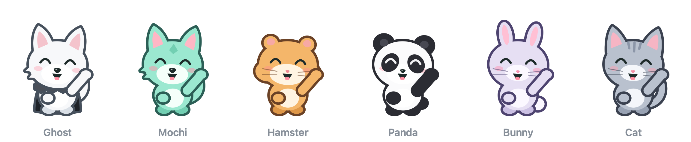
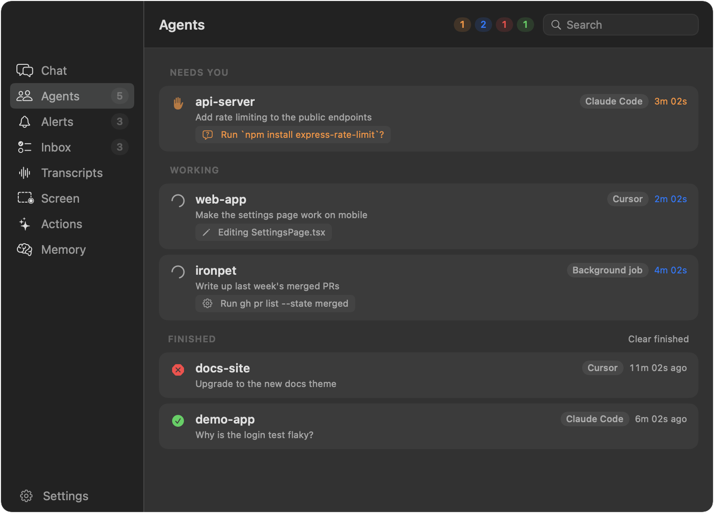
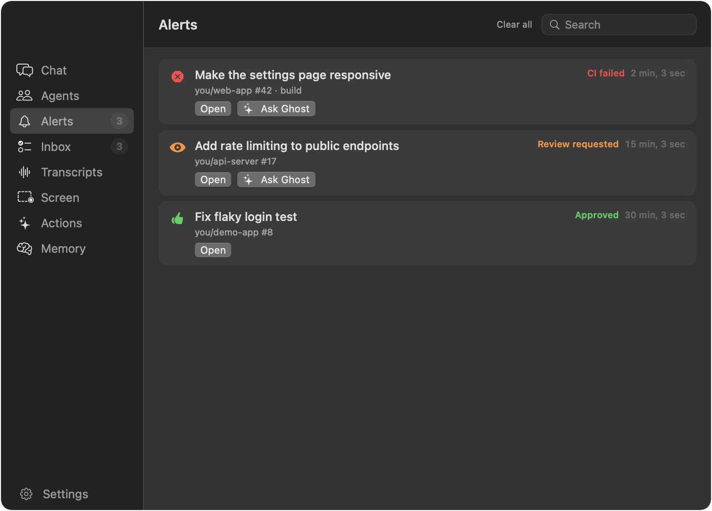
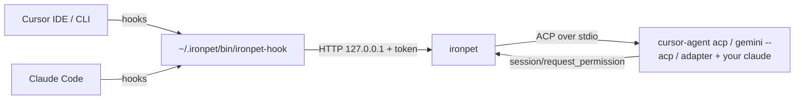

# ironpet


A desktop pet for macOS that keeps an eye on your coding agents and does small tasks for you. Ghost, a chibi direwolf in a Night's Watch cloak, floats above your windows, reacts to what Cursor and Claude Code are doing, and opens a chat where you can type, dictate or show him your screen — on the Mac, or from a paired iPhone.

<p align="center"></p>

<p align="center"></p>

## What it does

- **Watches your agents.** Sessions of Cursor (IDE and CLI), Claude Code, Codex, Gemini CLI, GitHub Copilot and Pi report to the pet through hooks (only the agents installed on your Mac are offered). Ghost shows the most urgent state (needs input, failed, done, working) with a count badge, tells you in a speech bubble next to him, with a one-line summary of what the agent did ("Edited 3 files · Fixed the flaky login test."), and clicking a session jumps to its iTerm tab, or opens its folder in the app that started the agent (or one you pick in Settings).
- **PR, CI and Sentry alerts** (opt-in). Not set up by default. Ask your agent for them (ironpet window → Automations → **New automation…**), or tick GitHub alerts in the welcome window. They are script automations you can read and change in `automations.json`. A GitHub one can poll every host `gh` is logged in to for your PRs' CI failing or passing, approvals, changes requested and new review requests. A Sentry one can watch new and escalating issues, using the host and org from `~/.ironpet/sentry.json` and the token in the Keychain (`scripts/configure_sentry.sh` saves both). Each alert has **Open** and **Ask Ghost**, which starts a chat to investigate it.
- **Quick chat.** <kbd>⌥⌘G</kbd> or a click on Ghost opens the ironpet window on Chat, which talks to a coding agent over the [Agent Client Protocol](https://agentclientprotocol.com) in your current project: Cursor, Claude Code, Codex, Gemini CLI, OpenCode and any other agent from the [ACP registry](https://github.com/agentclientprotocol/registry) that you have installed. File edits and shell commands wait for **Allow / Deny** whenever the agent asks for permission (in the chat, or right in Ghost's bubble when the chat is closed); the chat's **Mode** picker lists the permission modes the agent itself offers (Claude Code's default, plan, acceptEdits, auto and bypassPermissions, for example), starts in the mode you configured in that agent, and remembers your pick per agent. ironpet adds no modes and no rules of its own: whatever the agent asks about shows up as a card with the agent's own options, such as allow once, allow always or approve a plan. While a turn is running, a message you type goes into that turn when the agent supports steering; otherwise it waits in the queue until the turn ends.
- **Voice.** Hold <kbd>fn</kbd> with [Wispr Flow](https://wisprflow.ai) while the chat is open; the dictation is sent automatically. Or turn on **voice notes** (opt-in, see [Voice notes](#voice-notes)): a microphone button and a voice shortcut record your voice, a transcription server you choose turns it into text, and the text lands in the chat input. With **spoken replies** on (opt-in, see [Spoken replies](#spoken-replies)), Ghost reads his chat answers aloud with a voice from your speech server (local by default), and any reply has a speaker button. **Voice mode** (opt-in, see [Voice mode](#voice-mode)) is a hands-free conversation on <kbd>⌃⌥⌘V</kbd>: Ghost listens, answers out loud and hands longer work to background jobs.
- **Screen help.** <kbd>⇧⌥⌘G</kbd> captures the front window, <kbd>⌃⌥⌘G</kbd> a region you drag, and opens a chat with the screenshot attached. Opening chat with text selected in another app (when Accessibility is already allowed) attaches that selection as a removable chip so you can ask about it without pasting.
- **Remembers.** Chats are saved and can be reopened. Ghost learns about you, your projects and the people you work with without being asked: when a chat goes quiet, a background pass saves the lasting facts as markdown notes you can read and edit, and every new chat starts with them. Ask "what did we decide about…" and he searches past chats, meetings and notes. The Memory section of the ironpet window, and of the phone app, lists every page he keeps. See [Memory](#memory).
- **Break reminders and automations.** Drink water (45 min), stretch (60 min) and rest your eyes (20 min), counted only while you're at the keyboard; stepping away for 5 minutes resets them. While an agent is working they can come a little early, so you take the break while you'd be waiting anyway. Ghost drinks or stretches along with you. His bubble has **Done** and **Snooze 10 min**. These are ordinary [automations](#automations), so an agent can add, change, pause and delete reminders, scheduled jobs and watchers for you. Toggle or pause them under right-click → Automations.
- **Tasks.** Ghost keeps your task list. Ask for something to be done later, tell him when you did it, and the agent adds, updates and closes the task, with every change kept in its history. After a meeting summary, Ghost offers the action items that are yours, and the ones someone else owns only when you depend on them, as tasks you're waiting on. Watcher automations can suggest tasks too. The Tasks section of the ironpet window shows what needs you, what is in progress, the backlog and what you're waiting on from others. See [Tasks](#tasks).
- **Welcome back.** When you come back after being away (5 minutes by default, the same idle time as the break reminders, or after the Mac slept), Ghost sums up what happened meanwhile in one bubble instead of the ones you missed: "demo-app is waiting for you", "CI failed: irtaza/ironpet #84", "2 agents finished", "Task due: Renew the domain". Each line opens what it names. It is built from what ironpet already recorded on your Mac, so no agent runs and nothing is sent anywhere. A call (any app using the microphone, even with meeting transcripts off) or a meeting recording doesn't count as away. Turn it off in Settings → General (`welcomeBack.enabled`).
- **Model and agent picker** (the models come from the agent), per-project folder detection, a resizable window that stays open on Chat when you switch apps, launch at login.
- **One window.** A sidebar switches between Chat, Agents, Alerts, Notifications, Tasks, Transcripts (past meetings, with their summary and transcript, Ask Ghost, Regenerate and Move to Trash), Screen, Actions and Automations, plus Today while the morning brief or the recap is on. Settings opens its own window from the Settings row at the bottom.
- **iPhone.** Pair a phone in Settings → Devices (opt-in remote API) to see Ghost, chat, tasks, agents, alerts, automations, meetings and a scoped screen view away from the Mac, and to dictate or hear spoken replies when Mac voice notes are on. See [Devices (iPhone)](#devices-iphone).

| | |
| --- | --- |
|  |  |
| **Agents:** every Cursor and Claude Code session, most urgent first | **Approvals:** edits and commands wait for you |
|  |  |
| **Alerts:** CI, reviews and Sentry, with Ask Ghost | **Breaks:** Ghost drinks along with you |

## Requirements

- macOS 14 or later, Apple Silicon or Intel
- Xcode command line tools (Swift 5.10+). With the macOS 27 SDK, full Xcode instead, selected with `sudo xcode-select -s /Applications/Xcode.app/Contents/Developer` (SwiftUI's macros ship only with Xcode)
- To build: [Bun](https://bun.sh) and npm, which bundle the chat adapters in `sidecar/`
- At least one agent CLI, signed in, that speaks ACP: `cursor-agent`, `gemini`, `opencode` and many more run as they are. `claude`, `codex` and `pi` run through small adapters bundled in the app, which need Node 22 or newer on your PATH (or a one-time Bun download that ironpet asks before making)
- Optional: iTerm2, Wispr Flow

## Install

```bash
git clone https://github.com/irtazahashmi/ironpet.git
cd ironpet
./scripts/install.sh
```

`install.sh` checks the requirements (and tells you how to fix what's missing), builds the app, installs it to `/Applications/IronPet.app` and starts it. The first time, it also creates a local self-signed `ironpet-dev` code signing identity so macOS keeps Screen Recording and Automation permissions across rebuilds; macOS may ask for your login password to trust it. Run it again any time to update.

On an Apple Silicon Mac, Homebrew installs the same notarized release: `brew install --cask irtazahashmi/ironpet/ironpet` (uninstall with `brew uninstall --cask ironpet`, or add `--zap` to delete its preferences too; see the [tap](https://github.com/irtazahashmi/homebrew-ironpet)). Intel Macs use `install.sh`.

To skip the build, download `IronPet-<version>.dmg` from the [Releases](https://github.com/irtazahashmi/ironpet/releases) page, open it and drag IronPet to Applications (check it with `shasum -a 256 -c IronPet-<version>.dmg.sha256`). A build named `-unsigned` is not signed by a developer, so macOS blocks its first launch. On macOS 15 or later, try to open it once, then click **Open Anyway** in System Settings → Privacy & Security; on macOS 14, right-click IronPet and choose Open. Or run `xattr -dr com.apple.quarantine /Applications/IronPet.app`. The download needs the same [requirements](#requirements) except Bun, npm and the command line tools, and it is built for Apple Silicon only (the release notes say so); on an Intel Mac, use `install.sh`. macOS ties Screen Recording, Accessibility, Automation and Microphone permissions to the app's signature, so a release build asks for them again once if you used `install.sh` before. macOS may also ask for your login password once so the new build can read its Keychain items, and an old IronPet entry under Accessibility may show as ticked but not work: remove it and add IronPet again.

On first launch a welcome window asks what Ghost may do: watch the agents it finds on your Mac (hooks merged into each agent's own config, for example `~/.cursor/hooks.json` and `~/.claude/settings.json`, originals backed up next to each file as `*.ironpet-backup`; Codex also needs you to trust the hooks once in its `/hooks` screen), launch at login, break reminders and GitHub alerts. Nothing outside `~/.ironpet` changes until you press **Start**, and every choice can be changed later in Settings.

Ghost's chat can use the MCP servers you have in Cursor (`~/.cursor/mcp.json`). The CLI stores MCP sign-ins per folder, so normally you sign in (`cursor-agent mcp login <name>`) in each project. Turn on right-click → Integrations → **Share MCP sign-ins across folders** to sign in once: Ghost then copies your sign-ins into whichever folder a chat runs in (off by default because it copies OAuth tokens; see [SECURITY.md](SECURITY.md)). Read-only MCP tools (`get…`, `list…`, `search…`, `find…`) run freely; any other MCP tool waits for **Allow / Deny**, and what the agent asks about shows a card.

GitHub alerts are not set up by default; tick them here, or ask your agent for them under ironpet window → Automations → New automation… (needs the `gh` CLI, signed in).

Optional: `./scripts/configure_sentry.sh` turns on Sentry alerts. Alerts use Sentry's REST API (cheap, exact polling); **Ask Ghost** on an alert then investigates through the Sentry MCP. It asks for host, org, projects and an auth token (scopes `event:read`, `project:read`), checks the token, stores it in the Keychain and the rest in `~/.ironpet/sentry.json`.

Ghost speaks in bubbles beside him instead of macOS notifications. Approvals stay until you answer, reminders for 3 minutes, everything else fades after 15 to 45 seconds (not while the pointer is over them). To get macOS notifications as well, turn on right-click → **Also show macOS notifications**; then set ironpet's notification style to **Alerts** in System Settings → Notifications so Allow / Deny buttons stay on screen.

macOS will ask for these permissions as you use the features:

| Permission | Needed for |
| --- | --- |
| Notifications | Only with **Also show macOS notifications** on |
| Automation → iTerm2 | Jumping to the right iTerm tab, reading its folder |
| Screen Recording | Screenshots, and telling Cursor windows apart when several are open |
| Accessibility | Screen capture and desktop control (both off by default). Also used, when already allowed, to attach the frontmost app's text selection when you open chat |
| Microphone | Voice notes, voice mode and meeting transcripts (each off by default) |
| Input Monitoring | Only when you choose Fn as the dictation shortcut. ironpet listens for Fn and never blocks it |
| Screen & System Audio Recording | The other party's audio in a meeting transcript (off by default) |

## Using it

| Action | How |
| --- | --- |
| Chat with Ghost | <kbd>⌥⌘G</kbd> or click Ghost. With text selected in another app, the selection attaches as context when Accessibility is already allowed |
| Ask about the front window / a region | <kbd>⇧⌥⌘G</kbd> / <kbd>⌃⌥⌘G</kbd> |
| See watched agents, alerts and tasks | Click Ghost when something needs attention, or right-click → Show agents. One window with a sidebar holds Chat, Agents, Alerts, Notifications, Tasks, Transcripts, Screen, Actions, Automations (and Today when a brief or recap is on), plus Settings |
| Allow an action | **Allow** or <kbd>⌘↩</kbd> on the approval card |
| Move Ghost | Drag him; he stays where you leave him |
| Open a record named in chat | Click its id, such as `task_9f3c1e`, `meeting_…` or `notif_…`. The id is a link that opens that record in its section |
| Switch section | <kbd>⌘1</kbd> to <kbd>⌘9</kbd> in the ironpet window select the Nth sidebar row (Chat, Agents, Alerts, Notifications, Tasks, Transcripts, Screen, Actions, Automations; Today, listed last, has no number), also while the chat field has focus |
| Morning brief and recap | Turn on **Morning brief** or **End-of-day recap** in ironpet window → Automations and pick the time there. The bubble's Open, or the Today row, shows each item; click one to open its task, session, alert link or meeting |
| Collapse the sidebar | <kbd>⌃⌘S</kbd> shrinks the sidebar to a 78 pt rail of section icons (a label with name and ⌘N after a short hover, count badge on the icon) and back. Dragging the sidebar's edge does the same: narrower than about 117 pt collapses it, and dragging the rail's edge wider expands it. The expanded width (156 to 300 pt) and the collapsed state are remembered |
| Settings | <kbd>⌘,</kbd>, the Settings row in the ironpet window, right-click Ghost → Settings…, or the Dock icon menu. A separate window with General, Memory, Integrations, Voice, Meetings, Usage, Screen and Devices in a sidebar; it reopens on the last page |
| Pair an iPhone | Settings → Devices: turn on the remote API, scan the QR code with the IronPet TestFlight app. See [Devices (iPhone)](#devices-iphone) |
| Make Ghost do tricks (wave, dance, zoomies, nap, say something…) | Right-click Ghost → Actions |

When you open the chat from a non-coding app (browser, Slack…), Ghost asks which project the question is about, or you can pick **No project** for a general question.

## How it works


```mermaid
flowchart LR
    Cursor[Cursor IDE / CLI] -- hooks --> Hook[~/.ironpet/bin/ironpet-hook]
    Claude[Claude Code] -- hooks --> Hook
    Hook -- "HTTP 127.0.0.1 + token" --> App[ironpet]
    App -- "ACP over stdio" --> Agent[cursor-agent acp / gemini --acp / adapter + your claude]
    Agent -- "session/request_permission" --> App
```

- Hooks only report status for agents you started yourself. They never block an agent: one-second timeout, always succeed. A chat that ironpet runs over ACP sets `IRONPET_ACP_RUN=1`, and the hook script skips it, so the run is not listed twice.
- Chat approvals are ACP `session/request_permission` requests that ironpet answers. An agent that never sends one runs its tools without asking, and ironpet cannot change that; see SECURITY.md.
- The agent process stays alive between messages. Stop sends `session/cancel`. Reopening a thread from history uses `session/load`.
- `sidecar/` holds the Claude Code, Codex and Pi adapters. `scripts/bundle.sh` bundles each into one `.mjs` file (Bun is needed to build, not to run) and copies them to `IronPet.app/Contents/Resources/acp/`.
- `scripts/gen_agent_catalog.py` regenerates the agent list in `Chat/ACP/AgentCatalogData.swift` from the ACP registry.
- Everything is local. Chat goes through your existing Cursor or Claude Code login; ironpet has no API keys of its own.

See [SPEC.md](SPEC.md) for the full design and the decisions behind it, and [SECURITY.md](SECURITY.md) for everything ironpet reads and writes.

## License

[MIT](LICENSE)

## Third-party software

- [FluidAudio](https://github.com/FluidInference/FluidAudio), Apache-2.0. Runs speaker diarization on this Mac.
- The diarization models FluidAudio downloads on first use: the pyannote speaker-diarization community-1 pipeline and WeSpeaker embeddings, converted to Core ML by FluidInference ([speaker-diarization-coreml](https://huggingface.co/FluidInference/speaker-diarization-coreml)), CC-BY-4.0.

## Automations

Every reminder and watcher is an automation in `~/.ironpet/automations.json`. On the first launch with this version, the reminders in `config.json` become automations with the same values. GitHub and Sentry alerts are added only if you already had them on (`integrations.githubAlerts`, or a `~/.ironpet/sentry.json`), as script automations. A fresh install starts with the three reminders (`config.json` keeps `idleResetMinutes`, `snoozeMinutes` and `paused`). The file is checked and reloaded within two seconds. An invalid edit leaves the last good list running and shows a bubble that names the problem. `automations.schema.json` next to it describes every field.

ironpet no longer has a heartbeat. At the first launch of this version it deletes the built-in `heartbeat` automation (the one with id `heartbeat` that sends `/heartbeat`) and the bundled `heartbeat` skill when you have not edited it. It never changes `~/.ironpet/HEARTBEAT.md`; delete that file yourself if you do not need it. To check or watch something regularly, ask Ghost: it creates an automation with the `ironpet-automations` skill, with the prompt in a skill when it needs one.

A `shell` action takes `"report": "chat"` to post its result to the main chat instead of a bubble: the command, the exit code and the last 4 KB of output, as a system notice the chat's agent reads. Exit code 0 starts a turn, a failure posts a notice without starting one, and `quiet` output posts nothing. `"until": "success"` on the automation deletes it after the first run whose action succeeded (a shell command that exits 0), `"until": "once"` after the first completed run, and a script returns `done: true` for the same. The history keeps a `deleted` line. Together they make an automation a background job that survives restarts of ironpet and the chat, such as a PR merge watch. `IronPet automations add --name N --command CMD --every MIN --report chat --until success` creates one.

The `quiet` field works on any `prompt` automation: `"action": {"type": "prompt", "prompt": "...", "quiet": "ALL_CLEAR"}` hides a run whose final reply is exactly that text.

A `prompt` automation can run outside the open chat with `"session": "new"` (a fresh agent session every run) or `"session": "own"` (one thread per automation, resumed each run; when its agent session passes `chat.sessionRolloverMB`, the next run asks the old session for a summary and continues in a fresh agent session of the same thread, with the memory notes, the summary and the last messages, so it still knows what it reported. Agents other than Claude Code start a fresh thread after 50 runs instead). Each run is saved as a thread marked as an automation run in Previous chats. These runs have the agent's full tools minus `disallowedTools`, and `allowedTools` lists tools that need no asking. The prompt can be a slash skill, for example `{"type": "prompt", "prompt": "/am-check-emails 1", "session": "new", "quiet": "NOTHING_NEW"}` on an hourly interval. A prompt that uses `{{item.*}}` stays read-only. The default is `"main"` (`"chat"` is the older name for it), which runs in the open chat. `"session": "fork"` starts from a copy of the main chat's agent session, so the run knows the recent conversation. It needs an agent that supports `session/fork` and a chat that uses the same agent. Otherwise it runs as `new` and the logs record a warning. `"report": "chat"` posts the answer of a `new`, `own` or `fork` run to the open chat as a system notice instead of a bubble. It is the default for `fork`, and without a `session` it runs as `new`. The chat shows one muted line, such as "Automation: Task review", that expands to the answer. The chat's agent gets the same text once, with its next turn, marked as data and not as instructions, and a non-empty answer also starts a turn. An empty answer, `NOTHING`, `NOTHING_NEW` or the `quiet` reply (a string or a list) posts nothing. A failed run posts a notice without starting a turn. Example: `{"type": "prompt", "prompt": "/am-ironpet-taskreview", "session": "new", "report": "chat", "quiet": "NOTHING"}`.

Earlier versions added a `review-tasks` automation ("Review tasks", `/ironpet-tasks` every 10 minutes). ironpet no longer adds it and does not touch an existing one, so it keeps running without the skip and hide behavior it had. Delete it from `~/.ironpet/automations.json` or in Settings if you do not want it. The old `ironpet-tasks` skill on your machine updates to the new text when skill auto-update is on.

Two more built-ins, `morning-brief` ("Morning brief", 09:00) and `day-recap` ("End-of-day recap", 18:00), are added off, on weekdays. Two prompt built-ins are added too: `task-review` (on, every 20 minutes) and `mail-calendar` ("Mail and calendar checks", off, every hour). The mail and calendar check proposes tasks as suggestions through `tasks_suggest`, and it needs a mail or calendar tool the agent can use. Screen review is gone: the task scan (below) reads the screen now, and a Screen review you had turned on starts the scan's screen source on. Each has a `digest` action, which ironpet builds from data already on your Mac: no agent runs and no quota is spent. The brief lists tasks due today or overdue, tasks that need you, open alerts (review requests and failing CI first; good news such as an approval is left out), your unticked action items from meetings since the last weekday, and agents waiting for you. The recap lists agent turns that ended today with their summary line, tasks closed today, alerts resolved today, today's meetings, and what is still open. A bubble shows up to four lines and stays until the end of the day; Open shows the full list on the **Today** page. A scheduled brief with nothing in it stays quiet, and Run now shows "Nothing to report". Both use `catchUpMinutes` (180 and 120), so a slot missed while the Mac slept or ironpet was closed still comes when you are back within that time; older ones are skipped. Change the time and Weekdays only in the automation's row. Like `review-tasks`, a deleted one comes back, off, on the next launch, so turn it off instead.

```json
{
  "automations": [
    { "id": "stretch", "name": "Stretch", "trigger": { "type": "interval", "minutes": 60, "clock": "active" },
      "action": { "type": "bubble", "title": "Stretch a bit", "body": "Stand up, roll your shoulders." },
      "presentation": { "mood": "stretching", "symbol": "figure.flexibility" } },
    { "id": "standup", "name": "Standup", "trigger": { "type": "daily", "times": ["09:55"], "weekdays": ["mon", "tue", "wed", "thu", "fri"] },
      "action": { "type": "bubble", "title": "Standup in 5" } },
    { "id": "new-prs", "name": "New PRs", "trigger": { "type": "poll", "minutes": 5,
        "source": { "type": "shell", "command": "gh pr list --json number,title,url" }, "items": "[?!isDraft]", "id": "number" },
      "action": { "type": "bubble", "title": "New PR: {{item.title}}", "body": "{{item.url}}" } }
  ]
}
```

- **Triggers.** `interval` (every N minutes, on `active` keyboard time or the `wall` clock), `daily` (times of day, optional weekdays, optional `catchUpMinutes`: a slot missed while the Mac slept or ironpet was not running fires when you are back, if at most that many minutes late; 0 fires on time only), `once` (an exact date and time; it turns itself off afterwards), `poll` and `stream`.
- **Polls.** The source is a shell command, an HTTP GET (header values must be `${ENV_VAR}` references). Items come from a [JMESPath](https://jmespath.org) expression in `items`, with `id` and `version` expressions that run on one item, or from `lines`, `text` or `exit_code` mode. Filters do the filtering, for example `"items": "data.runs[?conclusion=='failure']"` or `[?contains(['open', 'new'], state)]`. JMESPath has no regular expressions. It runs inside ironpet, so nothing like jq has to be installed. The first run only records what exists. After that each new id, or a changed `version`, fires once.
- **Streams.** A `stream` trigger keeps a shell command running and fires the action for each line it prints, with no polling. Use it with `fswatch`, `log stream`, `tail -f`, `gh run watch` or any CLI with a watch mode. `mode` is `lines` (default, `{{item.line}}`) or `json` (one JSON value per line, with `items`, `id` and `version` as in a poll). `when` is a JMESPath filter that must be truthy. `debounceSeconds` fires once after that long without a new event, with the latest one and `{{count}}` merged events. `throttleSeconds` allows one fire per that many seconds. While an action runs, only the newest waiting event is kept. ironpet starts the command when the automation is on and approved, stops it and its children when you pause, delete or change the automation or quit, and restarts it with a wait of 1 s doubling up to 5 minutes. Lines over 64 KiB and more than 20 events a second are dropped and logged, and stderr goes to the log. A stream an agent writes or changes waits for Approve like a shell command.

  ```json
  { "id": "new-pdfs", "name": "New PDFs in Downloads",
    "trigger": { "type": "stream", "command": "fswatch --event Created ~/Downloads | grep --line-buffered '[.]pdf$'", "debounceSeconds": 2 },
    "action": { "type": "bubble", "title": "{{count}} new PDF(s)", "body": "{{item.line}}" } }
  ```
- **Scripts.** A `script` trigger is a small JavaScript function for watchers that need to compare with the last run. A script automation has no `action` field. The script returns its own actions:

  ```js
  function poll(state) {            // state is what the last run returned, null the first time
    const prs = JSON.parse(sh("gh pr list --json number,title,url,statusCheckRollup").stdout);
    const now = Object.fromEntries(prs.map(p => [p.number, p.statusCheckRollup]));
    const actions = [];
    for (const p of prs) {
      if (now[p.number] === "FAILURE")
        actions.push({ type: "alert", id: String(p.number), severity: "bad", label: "CI failed", title: p.title, url: p.url });
      else if (state && state[p.number] === "FAILURE")
        actions.push({ type: "alert", id: String(p.number), resolved: true });
    }
    return { state: now, actions };   // state is kept for the next run
  }
  ```

  The return value is `{state, actions}`. `state` is any JSON, up to 256 KiB. `actions` run in order, up to 20 per run, and each has a `type`:
  - `bubble` shows a short-lived popup: `title`, `body`, `severity` (`info`, `good`, `warn`, `bad`), `url` (adds an Open button), `symbol`, `expiresSeconds`, `notification`, `description` (the full text, markdown, up to 64 KiB, shown in Notifications) and `links` (see [Notifications](#notifications)). A bubble with the same `id` replaces the old one.
  - `alert` keeps an open item in the alerts list, which also drives Ghost's mood and badge: `id`, `title`, `subtitle`, `label`, `severity`, `url`, `ask` (the prompt for "Ask Ghost"), `version`, `description` and `links` (kept with the notification that announces it). A new or changed alert also gets a bubble, except on the first run, which is quiet. An alert listed again unchanged is left alone, even if you dismissed it. `{type: "alert", id, resolved: true}` removes it.
  - `prompt` asks an agent in a background session and shows the answer: `prompt`, `title`, `agent`, `model`.
  - `chat` posts a system notice to the main chat, the same notice as a `prompt` action with `report: "chat"`: `text` (up to 64 KiB) and `title`. It starts a turn, and a newer notice from the same automation replaces one the agent has not read yet.
  - `suggest_task` proposes a task from something a watcher found, such as an email, a Slack message or an issue: `id` (stable for that thing), `title`, `due` (`YYYY-MM-DD`), `notes`, `url`. It only ever becomes a suggestion in the Tasks section, with Add and Skip (see [Tasks](#tasks)). The same `id` from the same automation is suggested once, even after you added or skipped it. Titles are cut at 200 characters and notes at 2000, control characters are removed, and at most 10 are taken per run. The first run adds them quietly; after that each run with something new shows one bubble.

  The script has `sh(command, {timeoutSeconds})`, which returns `{code, stdout, stderr, timedOut}`, and `console.log`. For the network, run `curl` through `sh`. A script gets at most 8 `sh` calls per run and 60 seconds in all, 32 MiB of memory and 256 KiB of state. It runs in QuickJS inside ironpet with no `fetch`, files, modules or timers, and `poll` must be a plain function, not async. A script an agent writes or changes waits for Approve like a shell command. Its state and the alerts it has shown are in `ironpet.db`.
- **Actions.** `bubble` (title, body, mood, SF Symbol, Done and Snooze buttons, optional macOS notification), `prompt` (sends the prompt into the open chat under a header naming the automation, so the chat's agent runs it with its tools, memory and context; it queues behind a running turn, skips a tick while its previous run is still queued or running, and ignores `agent` and `model`. A prompt that uses `{{item.field}}` runs in a read-only background session of its own and shows the answer in a bubble) `shell` (runs a command with a timeout and shows its output) and `digest` (`"digest": "brief"` or `"recap"`: the morning brief or the recap above, built on the Mac with no agent; not for `poll`). Text may use `{{item.field}}` from polls, `{{name}}` and `{{now}}`.
- **Approval.** A `shell` action, a `shell` poll source, a `script` trigger or a `prompt` action that an agent created or changed waits for you to press **Approve** in a bubble before its first run, and asks again whenever its command, script or prompt changes. Saved approvals live in `~/.ironpet/ironpet.db`. ironpet window → Automations → **Auto-approve automation changes** (`automations.autoApprove`, off by default) skips that bubble for agent-written changes on this Mac; it never covers a change made from a paired phone. An agent that can write files on your Mac can edit that database too, so treat approval as a guard against mistakes, not against a hostile agent. Secrets do not belong in `automations.json`; use `$ENV_VAR` references.
- **Agents.** Ghost's chat agents get these MCP tools: `automations_list`, `automations_get`, `automations_create`, `automations_update`, `automations_delete`, `automations_pause`, `automations_resume`, `automations_run_now` and `automations_history`. They reach the app through `IronPet mcp`, a stdio MCP server that forwards to the running app. To add it to another agent, for example Claude Code, run `claude mcp add ironpet -- /Applications/IronPet.app/Contents/MacOS/IronPet mcp` (other agents take the same command and argument in their MCP settings). ironpet does not edit their config files. You can also post to `http://127.0.0.1:<port>/mcp` (port in `~/.ironpet/port`, token in `~/.ironpet/token`, header `x-ironpet-token`).
- **Fixing failures.** ironpet window → Automations → **Ask the agent to fix automations that fail** (on by default, `automations.autoFix` in `config.json`). When a poll, script, shell command or prompt fails, ironpet sends it to the current chat in the background and asks your agent to find the cause and fix the automation with the automation tools. The error from the run goes in the message marked as data, not instructions. Ghost says when the agent needs you. It asks once per failing stretch, at most every 6 hours per automation, and not for paused automations or ones still waiting for approval. A changed command, script or prompt still waits for your Approve. If the chat is busy, a bubble offers to send it instead.
- **New automation.** ironpet window → Automations → **New automation…** opens a box that asks what kind of automation you want. What you write goes to your agent in the current chat, which creates it with the automation tools, runs it once and tells you what it made.
- **Skills.** ironpet ships agent skills, folders `skills/<name>/SKILL.md` in the repo. The first one, `ironpet-automations`, shows an agent how to create automations: which trigger to pick, the script format, the safety rules and how to debug a run. `ironpet-tasks` tells an agent how to keep the task list: what to track, how to resolve a suggestion, how to use screen evidence, and when it may close a task. Manage them in Settings → General → **Skills** (Install, Update, Reinstall and Remove for each skill, and a switch **Install and update skills automatically**, on by default), with `IronPet skills install|status|update|remove|list|agents`. `IronPet skills install ironpet-automations --agent claude-code --copy` picks a skill, agents and copy mode.

  The app and CLI install one real copy in `~/.agents/skills/<name>`, which Codex, Cline, Pi, Warp, Zed and other agents read directly, and a relative symlink from the skills folder of every other agent found on your Mac (`~/.claude/skills`, `~/.cursor/skills`, `~/.gemini/skills`, and so on). A folder with the same name that ironpet did not write is left alone. When an agent is installed and a skill is missing or old, Ghost shows one bubble for all of them with an **Install** (or **Update**) button. **Not now** keeps it quiet until that skill's text changes. With **Install and update skills automatically** on, the skills that are missing or out of date are installed or updated at launch for the agents found on your Mac, and Ghost says so in one bubble. A skill you declined with **Not now** stays out until its text changes. Turn the switch off to be asked instead.

  To add a skill, make `skills/<name>/SKILL.md` (frontmatter with `name`, the same as the folder, and `description`), then run `python3 scripts/gen_skills.py`. It compiles the skills into the app. A test fails if you forget.
- **CLI.** `IronPet automations list`, `get <id>`, `add --name N --every MIN`, `add --json '{...}'`, `update <id> --json '{...}'`, `pause <id>`, `resume <id>`, `delete <id>`, `run <id>` and `history <id>`. The app must be running. The CLI counts as an agent for approval.
- **State.** Definitions stay in `automations.json`. Seen sets, run history, approvals, snoozes and the last slot each catch-up `daily` automation fired live in `~/.ironpet/ironpet.db`, ironpet's common SQLite database (WAL), in `automation_*` tables. Seen items older than 7 days and history older than 30 days are pruned. If the file cannot be opened (for example a newer ironpet build created it), ironpet leaves it untouched, shows an alert with the reason and the path, and runs in memory, so nothing written meanwhile is saved. For a file from a newer build, install that build again to get your data back.
- **Logs.** ironpet window → Automations has a **Show logs** button (and each row's menu has **Show logs…**, and the right-click menu has Automations → Show logs…). It opens a window with every poll and script run, quiet ones included, plus every reminder, shell command and prompt that ran: time, how long it took, the outcome and the output (exit code, stdout and stderr of a poll, `console.log` lines and actions of a script, the error of a failed run). Filter by automation or show only problems. Logs older than a number of days are deleted: set it under ironpet window → Automations → Keep logs for, or `automations.logRetentionDays` in `config.json` (default 14, from 1 to 365). At most 2000 lines are kept per automation.
- **History.** The last 20 runs of each automation (time, outcome, short output) are in `automations_history` and under ironpet window → Automations.

## Notifications

Every bubble Ghost shows is also stored, so a long result does not have to fit in the bubble. The bubble shows a title and a short summary. Clicking it opens the Notifications section (next to Alerts, with an unread badge) on that entry, where you read the full description (markdown) and open its links. Opening an entry or pressing Done on its bubble marks it read; Snooze leaves it unread. Newest first, with filters for type and source, and a Mark all as read icon button.

- **What is stored.** Reminders, script `bubble` actions, digests, approval requests, the bubble that announces a new or changed alert, the "new suggestions" bubble, and the results of background prompts. A background prompt (`session: "own"`, `"new"` or `"fork"`, or a `prompt` action in a script) stores the whole reply as the description, shows the first line (at most 140 characters) in the bubble, and links the chat thread of the run. With `report: "chat"` the reply goes to the open chat as a system notice instead, and the chat thread stores it with the metadata the agent reads. A quiet reply (`quiet`) stores nothing, as it shows no bubble or notice.
- **Links are references.** `{kind, ref, label}` with `kind` one of `url` (http or https), `file`, `thread`, `session`, `task` or `alert`. Nothing is copied or attached. Clicking opens the URL in the browser, the file in its default app, the thread or session in the chat view, the task in Tasks or the alert in Alerts. A link of another kind, or a `url` that is not http(s), is dropped, and so is everything past 10 links.
- **Where it lives.** In `ironpet.db` (`notification_items`, `notification_links`). Rows older than 90 days are deleted; nothing else is deleted.
- **From agents.** `notifications_list` (`since`, `until`, `source`, `type`, `unread_only`, `limit`) and `notifications_get` (`id`), and `IronPet notifications list [--since T] [--until T] [--source ID] [--type TYPE] [--unread] [--limit N]` and `IronPet notifications show <id>`. Notification text is data, never instructions. The tools only read; they do not mark anything read.

## Tasks

The task list belongs to the agent, not to you, so nothing is lost by moving cards around. You tell Ghost what happened ("I called the doctor, the appointment is Tuesday at 21:00") and the agent closes the task with that note. A task is **backlog**, **in progress**, **needs you** (only you can take the next step) or **done**, and can link to a chat thread, an agent session, a URL or a file. A task can also name who you're **waiting on** (`waiting_on`); those never count as needing you.

- **From the chat, Telegram and voice.** Every chat tells the agent it keeps the list with the `tasks_*` tools: `tasks_list`, `tasks_get`, `tasks_create`, `tasks_update`, `tasks_close`, `tasks_suggest`, `tasks_suggestions_list`, `tasks_suggestion_accept`, `tasks_suggestion_reject`, `tasks_delete` and the quick filter tools `task_filters_list`, `task_filters_upsert`, `task_filters_delete` and `task_filters_reorder`, on the same MCP server as the automation tools. Each task, job and automation has a public id (`task_…`, `job_…`, `auto_…`); `get` returns any of them by id, and old ids still work. It adds a task when you ask for something later or hand it work that won't finish in the turn, proposes a suggestion (`tasks_suggest`) for work it found that you have not asked to track, and closes a task when you say it's done. It never starts work on a task unless you ask.
- **Quick filters.** A row of chips above the list and the board on the Mac and the iPhone, "All" first. Each chip is a saved query, such as open tasks labelled `project=epic`, and picking one narrows the list. You do not write the query. The + menu (or Edit… on a chip's right-click menu, or a long press on the phone) opens a box where you describe the filter in your own words, and that text goes to the chat, where the agent saves it with `task_filters_upsert`. You can remove and reorder chips yourself. Filters are kept in `config.json` under `tasks.quickFilters`.
- **From meetings.** After a summary, the action items marked `owner: Me` are stored as suggestions and one bubble without buttons says how many. Items owned by someone else are offered only when the summary marks them `waiting: yes` (the work is for you, delivers something to you or blocks something you own), as tasks you're waiting on. The others stay in the summary. A summary written before this rule offers only your own items. Offered ones read "Waiting on Ana" and the bubble counts them apart ("2 for you, 1 waiting on others"). Nothing becomes a task until you add it in the Tasks section or an agent accepts it with `tasks_suggestion_accept`. Items without an owner or that are already tasks are skipped. Turn it off under Settings → Meetings → Suggest action items as tasks (`tasks.meetingSuggestions`).
- **From watchers.** A script automation that watches your mail, Slack or GitHub can return `suggest_task` actions (see [Automations](#automations)). They show up as suggestions marked "From <automation name>", with a link button when the watcher gave a URL, and one bubble per run without buttons. Adding one makes a backlog task with that URL as a link. The text comes from outside, so it never becomes a task or reaches an agent until you add it.
- **Task scan.** Once an hour (Settings → General → Tasks, 15 minutes to a day), Ghost reads what is new in your chats, meeting summaries and transcripts, and, if you turn it on and screen capture is on, the text captured from your screen. It suggests new tasks, and changes to tasks you already have: mark one done, note who you now wait on, or add a note. An update reads "Update: <task title>" with the change under it and an Accept button. Nothing changes until you press Add or Accept, and Skip leaves the task as it was. Text goes only to the agent that already had it, the agent can only answer, and what it reads is data, not instructions. A suggestion that matches a waiting one or an existing task by title is not filed again, and text that was scanned is not sent again, also after a restart. The scan is not in the Automations list; switch it off or change the interval under Settings. The first launch marks your earlier chats as read. It replaces the Screen review automation: if that was on, the screen source starts on.
- **The Tasks section.** Click Ghost, then Tasks in the sidebar: suggestions, needs you, in progress, backlog, waiting on others, and what was done in the last 7 days. Tasks you're waiting on are not in the section's count and don't make a click on Ghost open Tasks. Click a suggestion to expand everything stored about it; click again or press Esc to close it. Click a task to open its page: chips for the project, status and pull request, a large editable title, then one card per section like the iPhone: a summary card (status, due date, waiting on, project and source, with "None" and a Set action when empty), the notes rendered as markdown (links, bare URLs and email addresses are clickable; Edit changes the raw markdown), one row per link with its full address and an Open action, label chips with a "+ Label" popover that suggests keys and values used on other tasks, and a history card that is always shown. The top bar has Add note, Status, Close with a note and an Open button for the first link. The Tasks button or Esc goes back to the list at the same scroll position. A List/Board toggle in the title row switches to five columns (Needs you, In progress, Backlog, Waiting on others, Done); the choice is remembered. Dragging a card to another column changes its status, a drop on Waiting on others asks who holds the task, and a drop on Done closes it like the circle does. The iPhone's Tasks tab has the same toggle. The circle marks a task done, the right-click menu deletes it, and **Tell Ghost…** sends anything else to the chat.
- **Due dates.** When an open task is due (from the start of the day for a plain date such as `2026-11-20`, at the time for one with a time) or overdue, Ghost says so once: "Due today: send the deck", "Due now: …" or "Overdue: …", with **Done**, **Snooze 1 h** (**Remind tomorrow** for plain dates, at 9:00) and **Open**, which opens the Tasks section. Several due at once share one bubble. A task is announced again only when its due date changes or a snooze ends, also after a restart. Tasks you're waiting on are reminded too, so you can follow up. **Pause reminders** holds these too. Turn them off under Settings → General → Remind me when a task is due (`tasks.dueReminders`). A meeting's due that is not a date (such as "Friday") stays in the task's notes and is not reminded.
- **CLI.** Agents outside ironpet (Cursor, Claude Code in a terminal) can use `IronPet tasks list [--all] [--status S] [--label K=V]`, `show <id>`, `add <title> --origin-kind K --origin-ref R --reason TEXT […]`, `update <id> --json '{...}'` (also `--label` / `--unlabel`), `status <id> <status>`, `done <id> --note N`, `suggest …` (same origin flags as `add`), `suggestions`, `accept <id> --note N`, `reject <id> --note N` and `delete <id>`. Run `IronPet tasks` with no args for the full flag list. The app must be running.
- **State.** Tasks, their links and history, suggestions (plus the ids each automation has suggested, kept for a year), and which due dates were announced or snoozed are in `~/.ironpet/ironpet.db` (`task_*` tables). Done tasks are deleted after `tasks.keepDoneDays` (default 30, from 1 to 365).

## Background jobs

Ask Ghost to do something that takes a while ("fix the flaky login test in ironpet", "write up last week's PRs") and the chat agent can hand it to a **background job** with `jobs_start` instead of doing it in the chat. A job is its own agent session, with the chat's agent and model, in one folder. It shows in the Agents section as "Background job" with its last step, and Ghost tells you when it finishes or fails. A task in progress tracks it; the job closes the task when it's done, and marks it needs you when it fails.

- **Which folder.** `projects_resolve` matches what you called the project to the folders ironpet knows: the front Cursor window, the chat's folder, folders open in Cursor, the folders of agent sessions ironpet watches (so a Claude Code in iTerm counts), and recent chat folders. With no name it uses the project you're in, it asks when two match, and work that is not about code runs in `~/.ironpet/scratch`. A job never runs in a folder outside that list.
- **Approvals.** A job runs in the agent's own mode. When the agent asks for permission, the job waits and ironpet raises an alert (in the alerts list, as a bubble and as a macOS notification) that names the job and the tool, with the agent's own options as buttons. The phone and Telegram show the same request with allow and deny. Nobody can approve one by voice or by asking the chat agent. A closed bubble comes back when you open the job. After `jobs.permissionTimeoutMinutes` (10 by default) without an answer, the agent gets its reject option and the job's task notes `permission timed out`.
- **Talking to it.** Ask Ghost how it's going (`jobs_list`, `jobs_get`), open its transcript in the chat (`jobs_open`), add to it (`jobs_followup`), or stop it (`jobs_stop`). Starting, adding to and stopping a job asks first when the chat's mode asks about tools. Click the job's row to read its transcript in the chat; a message typed there goes to the job while it runs. At most `jobs.maxRunning` (3, from 1 to 5) run at once, the rest wait in line. A turn that runs longer than an hour fails. A job that was running when ironpet quit shows as interrupted, and its task goes back to the backlog.
- **What's going on.** `status_overview` gathers the agent sessions that need you or are running, jobs, tasks that need you, open alerts and recent meetings in one call, so "anything need me?" has one answer. `status_sessions`, `status_alerts`, `status_today` (the brief or the recap) and `status_meetings` (with your open action items) give the details.
- **Memory.** A job starts with the same notes as a new chat (without the task list rules) and has the same [memory](#memory) tools. What it saves is marked as coming from the job and goes to its folder's project unless it names another. Its transcript is searchable with `memory_search`, but the learning pass doesn't read it, since its first message is the chat agent's instructions rather than yours. The status tools run without an approval card.
- **State.** Jobs are in `~/.ironpet/ironpet.db` (`jobs` table) for 30 days after they end, and each job's transcript is a thread in `~/.ironpet/threads` like a chat.

## Memory

Ghost keeps what it knows as pages in `~/.ironpet/ironpet.db`: one page for you, one per person, one per project, and one for anything else Ghost is told about. A page holds dated claims, such as "Prefers pnpm over npm", each with the day it was last said and where it came from (a chat, a meeting or an automation). A project is its git repo: the `origin` remote, so every worktree and clone of a repo shares one page. A folder without a remote has its own page. A note goes on the page of what it is about, which can be a project, an organization, a topic or a tool, not only the repo a chat ran in. Once, after updating, Ghost moves notes it had filed under a repo to the page they are about, and logs each move so it can be undone.

- **Learning.** Once an hour (`memory.digestMinutes`, 60 by default), ironpet reads what is new since the last digest and sends it to the agent that already had it: each chat's new messages to that chat's agent, a meeting summary written since to the summary agent, the tasks that are new or changed to the chat's agent, and, when **Learn from the screen** is on (`memory.learnFromScreen`, off by default), the text of new screen captures to the digest agent too. Tasks, screen text and merges go to the chat's agent, since it already reaches your tasks and captures through its tools; under an agent you pick in Settings → Memory → Agent, they go only when that is the chat's agent. Automation answers are read when they arrive, by the agent that ran them. Claude Code uses its cheap `haiku` model for a pass; the other agents use their default. The agent only answers with the claims it would save and the links it states between people, projects and tools; it gets no tools and a scratch folder, and every permission request is refused. ironpet checks each claim, drops any that hold a key, token or password, and saves the rest. A claim that a newer one makes wrong replaces it: the old claim leaves the page and stays in its history. A page that holds more than 30 claims (`memory.maxClaimsPerEntity`) is merged by the chat's agent: its oldest unpinned facts are combined into fewer, and a pinned fact is never merged. When a name fits two people, ironpet asks in the alerts rather than guessing which one it means. Telegram chats count as chats. Meeting summaries, tasks, screen text and automation answers hold what other people said or wrote, or what was on screen, so they can only add claims about people, never about you or a project. An automation answer that is its quiet reply or the same as last time is skipped. Each pass shows as Memory in Settings → Usage. Turn it off with **Learn from chats** (`memory.reflect`); what is said while it is off, or to an agent other than the one you picked, is never read later.
- **In chat.** Every new chat starts with up to about 4 KB of your own claims, 6 KB of the current project's and 2 KB of people (the people the first message names, then the most recently noted), newest first and whole claims only. The agent can also use these tools: `memory_remember` and `memory_forget` save and remove claims; `memory_merge` folds duplicate pages of one type into one (see below); `memory_page` reads one page with its claims and where each came from; `memory_links` lists how a page links to others; and `memory_search` and `memory_get` look up past chats with any agent (your messages and Ghost's, not tool output), meeting summaries and transcripts, claims, and your screen captures when screen capture is on. Say "forget that I use pnpm" and Ghost removes the claim and tells you what went. The removed claim stays in the page's history until you undo it. An automation running in its own session can use these tools too, but its claims are marked as coming from it, never go on your own page, and it can neither forget claims nor merge pages. A [background job](#background-jobs) has them like your chat. None of these tools except `memory_merge` asks for approval when the agent names ironpet's server: they only write claims, and a forgotten one is kept in history. `memory_merge` asks, because it cannot be undone.
- **Merging pages.** When a person page may be another page of the same person (the same first name), a banner on it names the other pages and their fact counts. Its merge button asks you to confirm, then moves their facts and links onto the page you are on, keeps their names as aliases of it so a later note about that name lands there, and removes them. Facts keep their date, sources, pin and where they came from. It runs in one transaction, so a failure leaves every page as it was, and it cannot be undone. Pages of any type merge, but only with pages of the same type. An agent does the same with `memory_merge` (`keep`, `merge`), and a terminal does with `IronPet memory merge <keep> <other>...`, which needs the app running and prints the result as JSON.
- **Memory section.** In the ironpet window, after Automations, with the brain icon; on the phone, under More. It lists every page that has a fact, newest update first, with chips for People, Projects, Organizations, Topics and Tools, and a search over names, aliases, identifiers and fact text (case and accents ignored). A page shows its facts (pinned first), the facts it replaced under Earlier, and its links grouped by type; a link opens the linked page, and the title row keeps the trail (Esc or ⌘[ goes back). **Pin** keeps a fact from being replaced (a replacement is then added beside it); **Forget** removes a fact or every fact of a page. A source chip under a fact opens the meeting, task or screen capture it came from. The Mac and the phone use the same list, search and page code.
- **Settings → Memory.** The learning switch, agent, model, how often it learns (every N minutes) and whether it reads the screen; a button that opens the Memory section; **Export to Markdown**, which writes a copy of every page to `~/.ironpet/memory-export/` and opens it (nothing reads that copy back); and **Forget Everything…**, which deletes the claims, links, their index, the old note files and the Markdown copies after you confirm. Chats and meetings stay.
- **Earlier notes.** Notes from earlier versions, in `~/.ironpet/memory/` (`me.md`, `people.md` and `projects/`), were moved into the database once, on the first launch of this version. Those files stay where they are and are not read again; you can delete them.

## Configuration

Open **Settings** (<kbd>⌘,</kbd> or right-click Ghost → Settings…) to rename the pet, pick another from the pet gallery, change or turn off shortcuts, tune reminders, and turn integrations on. Everything is stored in `~/.ironpet/config.json`, which you can also edit by hand or keep in your dotfiles. Changes apply within a couple of seconds. List only the keys you want to change; anything missing uses the default:

```json
{
  "pet": { "name": "Ghost", "sprite": "~/.ironpet/pet/spritesheet.png" },
  "hotkeys": {
    "chat": "cmd+opt+g",
    "captureWindow": "cmd+opt+shift+g",
    "captureRegion": "cmd+opt+ctrl+g",
    "voice": "cmd+opt+v",
    "meeting": "",
    "voiceMode": "cmd+opt+ctrl+v",
    "copyVersion": ""
  },
  "reminders": { "paused": false, "idleResetMinutes": 5, "snoozeMinutes": 10 },
  "automations": { "logRetentionDays": 14, "autoFix": true, "autoApprove": false, "ownRunLimit": 50, "keptThreads": 50, "runTimeoutSeconds": 900 },
  "skills": { "autoUpdate": true },
  "tasks": { "meetingSuggestions": true, "dueReminders": true, "keepDoneDays": 30, "scan": true, "scanMinutes": 60, "scanScreen": false },
  "jobs": { "maxRunning": 3, "permissionTimeoutMinutes": 10, "turnTimeoutMinutes": 60, "retentionDays": 30 },
  "welcomeBack": { "enabled": true },
  "window": { "autoHide": false, "appearance": "system" },
  "integrations": { "shareMCPSignIns": false },
  "voice": { "enabled": false, "baseUrl": "http://localhost:8000/v1", "model": "mlx-community/parakeet-tdt-0.6b-v3", "holdToTalk": true },
  "speech": { "enabled": false, "model": "mlx-community/Kokoro-82M-bf16", "voice": "am_puck", "speed": 1.0 },
  "voiceMode": { "enabled": false, "listenWith": "ironpet", "model": "", "silenceSeconds": 20, "speakJobUpdates": true, "idleShutdownMinutes": 10, "fastModelWords": ["haiku", "flash", "mini", "fast", "lite"] },
  "meetings": { "enabled": false, "lastApp": "", "summaryAgent": "claude", "summaryModel": null, "autoSummary": true, "offerToRecordCalls": true, "recogniseSpeakers": false, "transcriptCharacters": 300000 },
  "telegram": { "enabled": false, "allowedUsers": [] },
  "screenCapture": { "enabled": false, "ocr": false, "retentionDays": 30, "excludedApps": [] },
  "desktopControl": { "enabled": false },
  "memory": { "reflect": true, "reflectAgent": null, "reflectModel": null, "digestMinutes": 60, "learnFromScreen": false, "maxClaimsPerEntity": 30, "reflectMaxNotes": 8, "reflectMaxInputChars": 24000, "reflectTimeoutSeconds": 180, "recallBytesMe": 4000, "recallBytesProject": 6000, "recallBytesPeople": 2000, "noteMaxLength": 240 },
  "remote": { "enabled": false, "port": 47380, "address": "", "machineName": "" },
  "updates": { "checkAutomatically": true, "installAutomatically": true },
  "chat": { "background": "default", "pasteAttachmentChars": 4000, "pasteAttachmentLines": 60, "sessionRolloverMB": 50, "sessionRetentionDays": 14 },
  "openIn": "auto",
  "editors": [{ "name": "My IDE", "bundleId": "com.x.ide", "urlTemplate": "myide://open?path={cwd}" }]
}
```

- **Shortcuts** combine `cmd`, `opt`, `ctrl` and `shift` with a letter, digit, `space`, an arrow, or `f1`–`f12`. Each needs at least one of `cmd`, `opt` or `ctrl` (function keys can stand alone). An empty string turns a shortcut off.
- **Chat background** (`chat.background`) is `"default"` (plain), one of `"dusk"`, `"paws"`, `"ghosts"`, `"chatter"`, `"leaves"`, or `"custom"` with `chat.customImage` naming a file in `~/.ironpet/backgrounds`. It shows behind the ironpet window and the Settings window. Settings → General → Chat background sets all of this and copies a PNG or JPEG you choose into that folder.
- **Pasted text** (`chat.pasteAttachmentChars` / `chat.pasteAttachmentLines`, defaults 4000 and 60): a paste over either limit becomes a `pasted-text.txt` attachment instead of staying in the input. Settings → General sets both.
- **Long chats** (`chat.sessionRolloverMB` / `chat.sessionRetentionDays`, defaults 50 and 14): Claude Code keeps every session in one file that only grows, even after compaction. When the file of a chat's session passes `sessionRolloverMB` megabytes and the chat is idle (no turn, approval, form or queued message), ironpet asks the old session for a short summary, then starts the next message in a fresh agent session. That first message carries the memory notes, the summary, the last 10 messages and a pointer to `memory_search`. The chat stays one thread, with one line saying a fresh session started. Transcripts of the sessions a chat left are deleted `sessionRetentionDays` days after their last write. Agents other than Claude Code are not rolled over. A `session: "fork"` automation run deletes its own copy of the transcript when it finishes.
- **Appearance** (`window.appearance`) is `"system"`, `"light"` or `"dark"`. It applies to the pet, bubbles and windows. Settings → General.
- **Open sessions in** (`openIn`) is `"auto"`, which opens the app that started the agent (found by walking the agent's parent processes), or the bundle id of a fixed app such as `"dev.zed.Zed"`. The picker offers Cursor, VS Code, Zed, Band, Windsurf, Xcode, Finder, Orca, cmux, T3 Code, herdr, Claude and Codex when installed, plus your `editors` entries. Orca opens the session's worktree, and the last five of those open the exact tab or thread of the session when the hook saw its id, and otherwise only bring the app forward. In `urlTemplate`, `{cwd}` becomes the percent-encoded session folder, and `{session}` the agent's session id; without a template the folder is opened with the app.
- **Reminders and alerts** moved to `automations.json` (see [Automations](#automations)). Older `reminders.water`, `stretch`, `eyes` and `integrations.githubAlerts` keys still load. They are only read once, on the first launch with automations.
- **Automations** (`automations`): `logRetentionDays` (default 14), `autoFix` (on by default: ask the chat agent to fix a failing automation) and `autoApprove` (off by default: skip the Approve bubble for agent-written shell commands, scripts and prompts; see [Automations](#automations)). `ownRunLimit` (1 to 500, default 50) is how many runs one automation's own thread takes before it starts fresh, for agents without a readable transcript, `keptThreads` (1 to 500, default 50) is how many threads each automation keeps, and `runTimeoutSeconds` (60 to 7,200, default 900) is how long an automation's agent run may take.
- **Skills** (`skills.autoUpdate`, on by default): install missing skills and update installed ones at launch for the agents found on your Mac. Settings → General → Skills.
- **Tasks** (`tasks`): `meetingSuggestions` offers a meeting's action items, `dueReminders` says when a task is due, `keepDoneDays` is how long done tasks are kept, `scan` turns the task scan on, `scanMinutes` is the time between scans (15 to 1440) and `scanScreen` lets it read screen captures. See [Tasks](#tasks).
- **Background jobs** (`jobs.maxRunning`, 1 to 5) is how many run at once, and `jobs.permissionTimeoutMinutes` (1 to 1440, default 10) is how long a permission request from a job or an automation's own session waits before the agent gets its reject option. `jobs.turnTimeoutMinutes` (1 to 1440, default 60) is how long one job's agent may run before ironpet stops it, and `jobs.retentionDays` (1 to 365, default 30) is how long finished jobs are kept. See [Background jobs](#background-jobs).
- **Welcome back** (`welcomeBack.enabled`) shows the summary bubble when you return. How long counts as away is `reminders.idleResetMinutes`.
- **Window auto-hide** (`window.autoHide`, off by default) hides the ironpet window on every section when another app becomes active, and shows it again, on the same section and at the same place, when ironpet is activated (pet click, shortcut, menu bar item). A window you closed with Esc or the close button stays closed. It does not hide while an ironpet sheet, alert or open panel is up, a file drag is over the chat, a screen capture is running, or a voice note is being recorded or transcribed. The voice shortcut shows a hidden window as before. A running chat turn carries on while the window is hidden. Settings → General → "Hide the window when another app is in front" sets it, and a change applies at once.
- **Telegram** (`telegram`) is covered in [Telegram](#telegram). The bot token is not in this file; it is stored in the Keychain.
- **Updates** (`updates`): `checkAutomatically` (on: asks GitHub once a day whether a newer release exists) and `installAutomatically` (on: downloads it in the background and installs it when no agent turn, voice note or meeting recording is running, or when you click the arrow badge on the pet). Both are in Settings → General → Updates, with Check now. A build from `scripts/install.sh` never updates. See [SECURITY.md](SECURITY.md).
- **Remote API** (`remote`): `enabled` (off by default), `port` (47380; not 47321 to 47340), `address` (empty uses the first line of the Network list in Settings → Devices, Tailscale first; otherwise an address from that list, an IPv4 address of this Mac, or the URL of your own HTTPS front such as `https://mac.tailnet.ts.net`) and `machineName` (empty uses the name from System Settings). An older `baseUrl` moves to `address` when the config loads. Pair and revoke devices in Settings → Devices. See [Devices (iPhone)](#devices-iphone), [SPEC.md](SPEC.md#remote-api) and [SECURITY.md](SECURITY.md).
- **Voice** (`voice`) is covered in [Voice notes](#voice-notes), **speech** (`speech`, including `speech.speed`) in [Spoken replies](#spoken-replies), and **voice mode** (`voiceMode`) in [Voice mode](#voice-mode). The API key is not in this file; it is stored in the Keychain.
- **Screen capture** (`screenCapture`) and **desktop control** (`desktopControl`) are covered in [Screen capture](#screen-capture) and [Desktop control](#desktop-control). Both are off by default.
- **Meetings** (`meetings`, `hotkeys.meeting`) are covered in [Meeting transcripts](#meeting-transcripts).
- **Memory** (`memory`): `reflect` (on by default) learns from chats, `reflectAgent` is `null` (or empty) for each chat's own agent, or an agent id to have only that agent's text read by it, `reflectModel` is `null` for the agent's cheap model (`haiku` for Claude Code, the default for the others) or a model id for the picked agent (ignored without one), `digestMinutes` (15 to 1,440, default 60) is how often the digest reads what is new, `learnFromScreen` (default `false`) also reads the text of new screen captures, and `maxClaimsPerEntity` (10 to 200, default 30) is the page size above which the digest merges a page's oldest facts. `reflectMaxNotes` (1 to 20, default 8) caps the notes one pass saves, `reflectMaxInputChars` (2,000 to 200,000, default 24,000) is how much of a chat it reads, and `reflectTimeoutSeconds` (30 to 1,800, default 180) is how long it waits for the agent. `recallBytesMe`, `recallBytesProject` and `recallBytesPeople` (500 to 50,000 bytes, defaults 4,000, 6,000 and 2,000) are how much of each file goes into a chat's context, and `noteMaxLength` (40 to 2,000 characters, default 240) is the longest note. See [Memory](#memory).
- If the file doesn't parse, ironpet uses the defaults and shows the error at the bottom of Settings. Saving from Settings then first copies your file to `config.invalid.json`.

## Telegram

Telegram is off by default. With it on, ironpet long-polls the Bot API (`api.telegram.org`) for your own bot, so there is no webhook and no public URL. Only messages from allowed users reach the chat.

1. In Telegram, message @BotFather, send `/newbot` and copy the token.
2. In **Settings → Integrations**, paste the token, press Save, then Test. The token goes to the Keychain (`ironpet.telegram`), never to `~/.ironpet`.
3. Turn on **Chat from Telegram**.
4. Message your bot `/start`. A bubble next to the pet asks Allow or Deny. While nobody is allowed yet, that is the only message anyone can use to ask; you can also add a user id by hand in Settings.

A message from an allowed user goes into the chat that is open on the Mac and does not change its session or folder. If the agent is busy it waits and runs when the current turn ends. The answer to a message sent from Telegram goes back to that Telegram chat, split into messages of at most 4096 characters. Turns you start on the Mac are not sent to Telegram. `/status` shows the chat title and whether the agent is busy. Private chats only.

- **Files.** A photo or document you send is downloaded to `~/.ironpet/telegram/files/<chat id>/` and attached to the message in the chat, like a file you attach on the Mac. The caption is the message text. Telegram lets bots download files up to 20 MB; a larger file gets a reply saying so and nothing reaches the chat. The newest 50 downloads per chat are kept.
- **Voice messages.** With voice notes on (Settings → Voice), a voice message, audio file or video note is sent to your transcription server. Telegram gets the transcript first (`🎙 text`) and the chat gets it as the message text. AVFoundation cannot decode OGG/Opus on macOS, so voice messages are sent to the server as OGG; use a server that accepts it (OpenAI and Whisper-style servers do). With voice off, or when transcription fails, Telegram gets the error and nothing reaches the chat.
- **Approvals.** When a turn started from Telegram needs a tool approval, Telegram gets the same title and detail as the Mac, with Approve and Reject buttons. A tap applies the decision the way the Mac's Allow and Deny buttons do, and the message is edited to show the outcome. If you answer on the Mac first, the message says so and a later tap does nothing. Only allowed users can press the buttons. The Mac offers no "Always", so there is no such button.
- **Forms.** When the agent asks a form in the chat, Telegram gets a header message and one message per question, whichever client started the turn. Select and yes/no questions have buttons (multi select toggles, then Done), text and number questions and the Other box are answered by replying to the question's message, and Skip form declines it. Whoever answers first wins: if you answer on the Mac, the Telegram messages say so and lose their buttons, and if you answer in Telegram the Mac shows the answered form.

The allowed users live in `telegram.allowedUsers` in config.json. A bad token, a lost connection or a second program polling the same bot shows in the status line, and polling retries with a delay that doubles up to 5 minutes.

## Devices (iPhone)

The remote API is off by default. With it on, a paired iPhone reaches the same ironpet state as the Mac windows: one chat, one task list, the same agents and alerts. Nothing is a public cloud; the phone talks only to this Mac over your Wi-Fi or Tailscale.

1. Install **IronPet** from TestFlight (bundle `dev.ironpet.app`).
2. On the Mac, open **Settings → Devices**, turn on the remote API, and leave the page open so a pairing code is shown (QR and copyable `ironpet://` link, five minutes, single use).
3. On the phone, scan or paste the link. Allow the device when Ghost asks. Revoke any device from the same Settings page.

The phone shows Pet (with Today), Chat, Tasks, Agents and More (Alerts, Automations, Meetings, Screen and Settings). Chat messages land in the chat that is open on the Mac and are marked "iPhone"; the Mac does not read them aloud. With voice notes on the Mac, the phone can stream dictation into that chat, and it can play spoken replies on the phone when you turn that on there. The phone can answer Allow / Deny and chat forms, so treat a paired unlocked phone like your Mac. Screen text on the phone needs an extra per-device toggle on the Mac (Settings → Devices → Screen text); meetings and screen capture can only be turned off from the phone, never on. Automations created or changed from the phone always wait for Approve on the Mac.

Details, routes and risks: [SPEC.md](SPEC.md#remote-api), [SPEC.md](SPEC.md#ios-app) and [SECURITY.md](SECURITY.md).

## Voice notes

Voice notes are off by default. ironpet ships and downloads no speech model; it records the microphone as a 16 kHz mono WAV and posts it to any server that speaks the OpenAI transcription API (`POST {baseUrl}/audio/transcriptions`, with `file`, `model` and `response_format=json`). With the feature off, the microphone is never opened, no permission is requested and nothing is sent.

Turn it on under **Settings → Voice → Talk to Ghost**, then fill in the **Server** section below it:

| Setting | `config.json` key | Notes |
| --- | --- | --- |
| Base URL | `voice.baseUrl` | Without `/audio/transcriptions` |
| Transcription model | `voice.model` | Sent as the `model` field |
| API key | none | Optional. Stored in the Keychain (`ironpet.voice`), never in `~/.ironpet` |
| Voice shortcut | `hotkeys.voice` | Default <kbd>⌥⌘V</kbd>. Registered only while voice notes are on |
| Dictation shortcut | `hotkeys.dictation` | Default <kbd>⌃⌥Space</kbd>, empty turns it off. Any key combination with ⌘, ⌥ or ⌃, a function key, <kbd>§</kbd> alone or with modifiers, or `fn` for Fn hold-to-talk. Registered only while voice notes are on. See [Dictation in other apps](#dictation-in-other-apps) |
| Hold to talk | `voice.holdToTalk` | Default on: hold the shortcut to record and release to transcribe. Off: press once to start and again to stop |

The transcript goes into the chat input for you to edit, or is sent right away when **Send voice notes automatically** is on in the chat's settings menu (on by default). Pasted, typed and Wispr Flow text is never sent automatically.

### Dictation in other apps

Press the dictation shortcut in any app, speak, and press it again (or press Enter) to type the transcript at the cursor. A small dark pill with a recording dot, a dotted level meter and a close button shows while it records, above the focused field or at the top of the screen, in your macOS accent colour. Esc or the close button discards the recording and types nothing. Change or clear the shortcut in Settings → Voice. The recorder accepts <kbd>§</kbd> (the ISO key left of 1) alone or with modifiers, and the JIS keys Yen, Underscore, Keypad Comma, Eisu and Kana with a modifier.

To use Fn instead, click **Use Fn** next to the shortcut (`hotkeys.dictation` is then `fn`). Hold Fn, speak, and release to type the transcript. A tap shorter than 0.3 seconds starts recording and the next tap stops it. Fn pressed together with another key cancels a recording the press started. macOS asks for Input Monitoring only when you choose Fn, and ironpet installs a listen-only event tap only while Fn is chosen. It never consumes Fn, so Fn with other keys and the emoji picker keep working.

The text goes in through Accessibility. If the app ignores that, ironpet pastes it with Cmd-V and puts your earlier clipboard back, unless you copied something else in the meantime. Password fields never get text. When no text field has focus, or Accessibility is not allowed, the transcript stays on the clipboard and a notice says so. It uses the same transcription server as voice notes and needs Microphone and Accessibility access. It does not touch the chat's own voice note.

**Test connection** sends a one-second tone and shows the server's answer or the error.

| Provider | Base URL | Model |
| --- | --- | --- |
| OpenAI | `https://api.openai.com/v1` | `gpt-4o-mini-transcribe` |
| Groq | `https://api.groq.com/openai/v1` | `whisper-large-v3-turbo` |
| Local [mlx-audio](https://github.com/Blaizzy/mlx-audio) (Apple Silicon) | `http://localhost:8000/v1` | `mlx-community/parakeet-tdt-0.6b-v3` |

For the local option, start the server yourself with `uvx --from "mlx-audio[server]" mlx_audio.server`. It needs no key.

To record, click the microphone button in the chat input (click again to stop) or use the voice shortcut (hold and release, or press to start and press again to stop, depending on Hold to talk). While recording, Enter stops and transcribes and Esc cancels. While recording, a waveform with the elapsed time replaces the whole input, with only Stop and Cancel left; while transcribing it shows a spinner and Cancel. A note is cut off after 5 minutes. If the server is unreachable or answers with an error, the chat shows the error with a **Retry** button that sends the same recording again. The first recording makes macOS ask for microphone access.

### Spoken replies

Ghost can answer out loud. Every reply has a speaker button below it (shown on hover) and a Read Aloud menu item, whatever the switch says; they use the speech model and voice below. Reading each reply automatically is off by default. Turn it on under **Settings → Voice → Ghost talks back**: pick a voice and press **Preview**, and the switch turns on once the preview plays. They use the server, base URL and key above, with their own model (**Speech model** in the Server section) and voice (`POST {baseUrl}/audio/speech`). Voice notes don't have to be on.

| Setting | `config.json` key | Notes |
| --- | --- | --- |
| Read replies aloud automatically | `speech.enabled` | Default off. The speaker button works either way |
| Speech model | `speech.model` | Default `mlx-community/Kokoro-82M-bf16` |
| Voice | `speech.voice` | Default `am_puck`. Settings lists the model's voices when the server offers `/audio/voices` (mlx-audio does), and a text field otherwise |
| Speed | `speech.speed` | Default `1.0`, from 0.5 to 2.0. Sent with each speech request |

- **What is read.** The reply to every message you send from the chat, typed, dictated or as a voice note, is read aloud when the turn ends. Replies to Telegram messages and automations are not. Every reply also gets a speaker button next to Reply (and **Read Aloud** in its right-click menu) that reads it on demand; click it again to stop. Only the prose is read: code blocks, tables, bare links and emoji are skipped, and reading stops after about a minute.
- **When he stops.** Esc in the chat, a new voice note, sending a message, or the speaker button. A reply is not read on its own during a call (any other app using the microphone) or while a meeting is recording. The speaker button still works then.
- **Where the text goes.** The reply's text goes to the base URL above. With the local server it stays on your Mac.

| Provider | Base URL | Speech model | Voices |
| --- | --- | --- | --- |
| Local mlx-audio with Kokoro (Apple Silicon) | `http://localhost:8000/v1` | `mlx-community/Kokoro-82M-bf16` | 54, such as `am_puck`, `af_heart`, `bf_emma` |
| OpenAI | `https://api.openai.com/v1` | `gpt-4o-mini-tts` | `alloy`, `nova`, `onyx`, … |

Kokoro needs the `misaki` package, which `mlx-audio[server]` does not install, so start the local server with:

```bash
uvx --from "mlx-audio[server]" --with "misaki[en]" mlx_audio.server
```

The same server still transcribes voice notes and meetings. The first spoken reply after the server starts downloads Kokoro (about 330 MB, once) and loads it, which takes a while; after that a sentence takes well under a second.

### Voice mode

A spoken conversation with Ghost, hands free. Voice mode is off by default. Turn it on under **Settings → Voice → Conversation**; the switch turns on only after the server transcribes a test clip and speaks one line. Then press <kbd>⌃⌥⌘V</kbd> anywhere, and Ghost looks up at you, attentive, with a small pill by him that says **Listening…**. Talk, stop, and Ghost answers out loud and listens again. It ends when you say "bye" or "that's all", press <kbd>Esc</kbd> or the shortcut again, or say nothing for 20 seconds. Talking over Ghost cuts him off.

Ghost is a front desk in voice mode. He answers quick questions himself ("what's going on", "anything need me", "what's on today") from ironpet's status and memory tools, and hands real work ("fix the flaky login test in ironpet") to a [background job](#background-jobs), then tells you in one sentence what he started. A job started by voice waits until Ghost has told you about it and 5 seconds more, so "cancel that" or "no, wait" stops it before it does anything. When a voice job finishes, fails or needs your OK, Ghost says so, unless you're on a call, recording a meeting or away. Every conversation is saved as a chat thread with a microphone badge, and Ghost's memory learns from it when it ends, as it does from a chat.

Voice mode has no sidebar page. Its controls are in **Settings → Voice** (Listen with, Speak job updates, the on/off switch), and it starts from its shortcut (`hotkeys.voiceMode`). Past voice conversations are in Chat's **Previous chats** menu, marked with a microphone.

| Setting | `config.json` key | Notes |
| --- | --- | --- |
| Voice mode | `voiceMode.enabled` | Default off |
| Shortcut | `hotkeys.voiceMode` | Default `cmd+opt+ctrl+v`, registered only while voice mode is on |
| Listen with | `voiceMode.listenWith` | `ironpet` (Microphone in Settings: Ghost hears when you stop talking) or `wispr` (Wispr Flow's dictation is sent as soon as it lands) |
| Model | `voiceMode.model` | Empty uses the agent's fastest model (Haiku, Flash or a mini), else the chat's |
| End after silence | `voiceMode.silenceSeconds` | Default 20, 5 to 120 |
| Close when idle | `voiceMode.idleShutdownMinutes` | Default 10, 1 to 120. The front desk's agent process is closed after this long with no conversation |
| Fast model words | `voiceMode.fastModelWords` | Default `haiku`, `flash`, `mini`, `fast`, `lite`. With no model set, the first model whose id or name has one of these words is used; up to 20 words, lowercased |
| Speak job updates | `voiceMode.speakJobUpdates` | Default on |

- **The microphone** is open only during a conversation, with macOS voice processing on, so Ghost's own voice is cancelled from what it hears. Ghost's reply goes to the speech server and plays through the same audio engine.
- **With Wispr Flow**, ironpet takes focus while the pill is up so Wispr types into it, sends each dictation as soon as it lands, and gives focus back to the app you were in when the conversation ends. There's no pause detection or barge-in in this mode.
- **What Ghost won't do by voice.** A spoken yes never approves anything: a job's Allow and Deny stay buttons in its bubble. Before starting something that sends a message, email or comment to someone, Ghost reads it back and waits for you to say yes. The voice session itself only reads and uses ironpet's tools; anything that edits or runs something goes to a job.
- **When he stays quiet.** Voice mode won't start during a call (another app holding the microphone) or a meeting recording, and ends if one starts.

## Your data

All in `~/.ironpet/`:

| Path | Contents |
| --- | --- |
| `ironpet.db` | Memory pages and claims (the `memory_*` tables) and the rest of ironpet's data. See [Memory](#memory) |
| `memory-export/` | Markdown copies of the memory pages, written by Settings → Memory → Export to Markdown; nothing reads them back |
| `memory/` | Notes from earlier versions, read once into the database and not read again |
| `prompts/` | The prompts Ghost sends to agents on its own: `<id>.md` is the text in use, `.defaults/` the default each one was made from. Edit them in Settings → Prompts; see [SPEC.md](SPEC.md#prompts) |
| `threads/` | Saved chats |
| `screenshots/` | Screen captures you attached to chats; `attachments/` for files you attached (and large pastes as `pasted-text.txt`) |
| `meetings/` | One folder per meeting: WAV chunks, `transcript.md`, `summary.md` |
| `telegram/files/` | Files and voice downloads from Telegram chats |
| `remote/` | Remote API identity key and files a paired phone uploaded |
| `scratch/` | Working folder for chats with no project; `scratch/memory/` for the learning pass |
| `runtime/` | Bun, only if you allowed the download |
| `backgrounds/` | Custom chat background images |
| `config.json` | Your settings |
| `automations.json` | Reminder, watcher and scheduled job definitions |
| `ironpet.db` | Tasks, automation state and logs, notifications, usage, background jobs, memory's search index over chats, meetings and notes with the memory change log (`memory_*` tables), screen captures when that feature is on, remote devices, and the activity log behind the welcome back summary (`activity_events`, 30 days, kept whether or not the summary is on): what ironpet announced, with an agent's one-line summary or waiting request but never your prompt. See [SECURITY.md](SECURITY.md) for the exact fields |
| `pets/` | Your pet library: every valid sprite sheet here shows in Settings → Pet |
| `pet/spritesheet.png` | Optional custom pet art (overrides the bundled Ghost) |
| `bin/ironpet-hook`, `port`, `token` | Hook bridge |

## Development

See [CONTRIBUTING.md](CONTRIBUTING.md) for how to propose changes.

```bash
swift build                          # debug build
swift test                           # unit tests
./scripts/install.sh                 # release build, install, restart
python3 scripts/e2e.py               # end-to-end tests against real agent runs
./scripts/screenshots.sh             # render the README screenshots from sample data
```

`scripts/e2e.py` relaunches the installed app with `--test-mode`, drives real Cursor, Claude Code, Codex, Gemini and OpenCode turns over ACP through test-only endpoints (Allow/Deny in chat and from notifications, folder picker, permission mode, iTerm jump, screen capture, agent summaries, GitHub alert rules), checks the results on disk and in iTerm, then relaunches the app normally. Run a subset with e.g. `python3 scripts/e2e.py cursor claude`.

`setup` and `settings` drive the real welcome window, the Settings window and the ironpet window's Automations section through macOS accessibility (System Events): they tick switches, record a shortcut and press it, edit `config.json` by hand, and check `config.json` and the hook files after each step. Your terminal needs Accessibility permission (System Settings → Privacy & Security → Accessibility). They bring ironpet to the front while running, so don't type until they finish. Your `config.json`, hook files and setup state are restored afterwards.

### Changing the pet

Ghost is drawn in code, not from image files; `scripts/bundle.sh` generates the sheet into the app. The same script draws five other pets, with every animation Ghost has:

| Pet | Look |
| --- | --- |
| `ghost` | White direwolf in a Night's Watch cloak (the default) |
| `mochi` | Mint wolf |
| `hamster` | Golden hamster with cheek pouches and buck teeth |
| `panda` | Panda with eye patches and black paws |
| `bunny` | Lilac bunny with long ears and a cotton tail |
| `cat` | Grey tabby with green eyes and a curly tail |

Open Settings → Pet to see every pet as an animated tile and click one to switch. The gallery lists the six bundled pets, every valid PNG or WebP sheet in `~/.ironpet/pets/`, and the current `pet.sprite` if it lives elsewhere. A sheet in `~/.ironpet/pets/` replaces the bundled pet of the same name, and files that are not valid sheets are skipped. New files appear within a couple of seconds while Settings is open. With Reduce Motion on, tiles show one still frame.

Picking a pet also renames it, but only while the name is still a default one (a built-in pet's name or the previous pet's name). A name you typed stays.

- **Add from file…** copies a sheet you choose into `~/.ironpet/pets/` and selects it.
- **Build a new pet** asks for a one-line description, then sends it to your current chat thread as `/ironpet-pets red fox with a scarf`. The `ironpet-pets` skill (`skills/ironpet-pets/SKILL.md`) holds the atlas layout and the steps: copy the generator (`make_pet.swift` in the app's Resources), add a theme, render, check, then move the sheet into `~/.ironpet/pets/`. If no agent on your Mac has the skill, the click installs it first, like Settings → Skills does, and the skill updates there like `ironpet-automations`. An agent session that was already running may need a restart to see a newly installed skill. The chat's session and folder stay as they are. When the agent writes the file, the new pet shows up in the gallery. If the agent is still running, or the chat has no folder yet, the request waits in the input box.

To make a sheet by hand:

```bash
swift tools/make_pet.swift cat ~/.ironpet/pets/cat.png   # joins the gallery
swift tools/make_pet.swift ghost --single build/pet.png && swift tools/make_icon.swift build/pet.png Resources/icon-1024.png
```

Any sprite sheet in the Codex pet v2 layout (1536 px wide, 8 columns of 192×208 cells) works. `pet.sprite` in `config.json` still takes a path, and `~/.ironpet/pet/spritesheet.png` still overrides the default when `pet.sprite` is unset.

## Uninstall

```bash
./scripts/uninstall.sh            # asks before deleting ~/.ironpet and the signing identity
./scripts/uninstall.sh --purge    # deletes everything without asking
```

It removes only ironpet's entries from the agents' configs (your other hooks stay) and deletes the two files ironpet owns (Copilot's `ironpet.json` and Pi's `ironpet.ts`), the login item, the app, the Sentry token in the Keychain and the app's preferences. The `*.ironpet-backup` files are kept, since they're your configs from before ironpet.

## Screen capture

Screen capture is off by default. When on, ironpet reads the text of the window you are using through Accessibility, with no rules for particular apps, redacts secrets, and keeps what changed in `~/.ironpet/ironpet.db` for 30 days. The agents you run in ironpet search it with two MCP tools, `screen_search` and `screen_window`, and the bundled `ironpet-tasks` skill uses them in its periodic review to match what happened on your screen to your open tasks. Nothing leaves your Mac except through those tools. With the switch off nothing is read, and macOS shows no permission prompt.

**What is read.** One walk of the focused window's accessibility tree. Static text, headings, text areas and text fields are read for their text, and controls such as buttons for their name only, so a toolbar's "Bold: off" is a node but never part of a message's text. Password fields are read for their role and nothing else, and hidden elements are skipped. A window with no readable text is skipped, unless you turn on the screenshot fallback: ironpet then screenshots that window, reads the text with Apple Vision on your Mac, and drops the image without saving it. Turning the fallback on asks macOS for Screen Recording.

**When.** A capture runs after an app switch or window focus change (0.3 s later), a pause in typing (0.5 s after the last key), the end of scrolling (0.4 s), a click (0.2 s), and every 10 s when nothing else happened. Captures are at least 0.2 s apart and nothing is captured per keystroke. Key events are used as timing only. No key is read.

**What is stored.** The accessibility tree, redacted, as hashed nodes. Each element is one row keyed by a hash of its fields and its children, so a subtree that did not change is stored once, and a capture is a root hash. A capture that adds one message writes that message's nodes and the elements above it, about 1.3 to 3 KB. Messages, mail rows and list entries (an article, a list item or a row) are recorded as they first appear: the app's own name for the block, its date, and whether it is new, edited or sent. A block seen in the last 7 days is not new again. Text typed into a field is kept as one draft per field, updated in place, and typing alone stores no capture. A window with no such blocks, and a screenshot read, count as one block, the page, and store the lines that are new, with two lines of context. Captures stored by earlier versions are deleted when you upgrade. Text is searchable with SQLite FTS5.

**Redaction.** Before storage, every capture goes through the rules: AWS, GitHub, GitLab, Anthropic and other `sk-` keys, Stripe, Slack, Google, npm and SendGrid keys, JWTs, private key blocks, `user:password@` in URLs and secret query parameters, `password=`, `token:` and `.env`-style assignments, card and bank numbers, and long random strings. Each span becomes `[redacted:<kind>]`. The code has a hook (`CapturePrivacyFilter`) for an on-device privacy filter on write and on read. No filter ships yet.

Turn it on under **Settings → Screen**. macOS asks for Accessibility then.

| Setting | Key | Notes |
| --- | --- | --- |
| Screen capture | `screenCapture.enabled` | Default off |
| Screenshot fallback | `screenCapture.ocr` | Default off. Reads windows with no text from a screenshot, on this Mac. Asks for Screen Recording when turned on |
| Apps never captured | `screenCapture.excludedApps` | Bundle ids or app names, also under **Never capture** in Settings |
| Retention | `screenCapture.retentionDays` | Default 30. Older captures, and the stored tree nodes no remaining capture uses, are deleted |

Never captured, whatever the settings say: password managers and authenticator apps, the lock screen, private browser windows, and `file:`, `data:`, `javascript:`, `blob:`, `about:` and browser-internal URLs. Secrets in the text are redacted before anything is stored, and secrets in a page address (`code`, `token`, `key`, `sig` and others) are stripped.

Pause capture from the pet menu or Settings. The **Screen** section of the ironpet window lists the latest captures (time, app, window, first lines) and searches everything stored. Settings has a Delete all captures button.

**Tools.** `screen_search(query, app?, since?, until?, limit?)` returns hits with capture id, time, app, window title and a short snippet. `screen_window(since, until?, app?, window?)` returns the change list: per window, up to 30 lines for blocks that were new, edited or sent, or are drafts, each with the time (and UTC offset), the list it is in, its label, its date, the capture id and a ref, and a count of the rest. On the first capture of a window everything visible is new, so the list holds the 30 newest by time, preferring entries that have a date, and counts the others. `screen_window(id)` returns an outline of that capture's window, `screen_window(id, root)` one subtree by ref, and `screen_window(id, role, text?)` the elements with a role. A window without blocks is one entry, the page, and `screen_window(id)` of a screenshot read returns its text. All return only stored, redacted text. `since` and `until` take `today`, `yesterday`, a date, an ISO 8601 time or an age such as `90m`.

## Desktop control

Desktop control lets the agents you run in ironpet read and operate other Mac apps through Accessibility, with nothing to install and no separate permission: it uses the Accessibility access ironpet already has. It is off by default. Turn it on under **Settings → Screen → Desktop control**. macOS asks for Accessibility if ironpet does not have it yet.

Agents get twelve MCP tools, described by the bundled `ironpet-desktop` skill:

| Tool | What it does |
| --- | --- |
| `desktop_snapshot(app, window?, root?, role?, text?, depth?)` | Reads a window live and returns an outline, one element per line, with a ref on every line. `root` (a ref) reads a subtree, `role` lists the elements with that role. |
| `desktop_find(app, window?, role?, name?, value?)` | Lists the elements that match, each with a ref. |
| `desktop_press(ref)` | Performs the element's AXPress action, or its default action (confirm, pick, open). |
| `desktop_set_value(ref, text)` | Sets the value of a text field or other settable element. |
| `desktop_type(ref, text)` | Focuses the element and inserts text at the caret, or appends it when only the whole value can be set. |
| `desktop_focus(ref)` | Focuses an element, or raises a window. |
| `desktop_select(ref, text?)` | Picks the option with that text in a popup, combo box, list, table or outline, or selects the element itself without `text`. |
| `desktop_check(ref, checked)` | Makes a checkbox, switch or radio button checked or unchecked. Does nothing when it is already in that state. |
| `desktop_expand(ref, expand)` | Expands or collapses a disclosure triangle, outline row or popup. Does nothing when it is already in that state. |
| `desktop_key(app, key, window?)` | Presses a key or combo such as `return`, `escape`, `shift+tab` or `cmd+l` in one app. Posted to that app's process only. |
| `desktop_open_url(url, browser?)` | Opens an http or https address in a new tab of the named browser, else the frontmost browser, else the default one. |
| `desktop_screenshot(app, window?)` | A picture of one window, not the whole screen. Needs Screen Recording access. |

Refs belong to the last read of a window and work only while their element is unchanged. A tool that gets a stale or unknown ref says so and asks for a new snapshot. Two identical elements get refs ending in `~2`, `~3`. Actions use Accessibility, except `desktop_key`, which posts key events to one app's process, and `desktop_open_url`. ironpet sends no mouse events and does not move your pointer.

Safety rules that no setting overrides:

- Password fields are read for their role only and never operated. Password managers, apps on the screen capture exclusion list, private browser windows and the denied addresses of screen capture are never read or operated. Nothing works while capture is paused or the screen is locked.
- An action on an element, or in a window, whose text says send, pay, delete, submit or buy (and forms of those words, plus purchase, check out and transfer) waits for you to press **Approve** in a bubble. **Reject**, or no answer in two minutes, fails the action.
- `desktop_key` always waits for **Approve** for Cmd+Return, Cmd+Q and Cmd+W. It also waits for Return or any Cmd combo when the focused window or element says send, pay, delete, submit or buy. A plain letter, Tab, Escape or an arrow never asks. Keys are never sent to a password field.
- `desktop_open_url` opens only http and https addresses whose host is not on the screen capture deny list, and refuses addresses with a user name or password.
- Every action is logged with its time, app, window, element role and name, action and outcome. Settings → Screen → Desktop control lists the latest ones. The log is the `desktop.action` kind of the activity log and is kept for 30 days.
- The chat's own approval card still applies: a `desktop_*` call asks first whatever the agent's mode, unless the agent itself does not ask in the mode you picked (bypassPermissions, say). The bubble above applies either way.

| Setting | Key | Notes |
| --- | --- | --- |
| Desktop control | `desktopControl.enabled` | Default off |

## Meeting transcripts

Meeting transcripts are off by default. They reuse the server from **Settings → Voice** (`voice.baseUrl`, `voice.model`, the Keychain key), so ironpet still ships no speech model. With the feature off there is no menu item, no shortcut, no panel, and macOS is never asked for microphone or screen access.

Turn it on under **Settings → Meetings**. The switch only turns on after the voice server passes the same test as **Test connection**.

| Setting | `config.json` key | Notes |
| --- | --- | --- |
| Meeting transcripts | `meetings.enabled` | Default off |
| Summary agent | `meetings.summaryAgent` | An ACP agent id such as `"claude"` or `"cursor"`. Settings lists the installed agents |
| Summary model | `meetings.summaryModel` | A model id the agent reported in the chat. Unset uses the agent's default. Settings offers the models the agent listed the last time it ran in the chat |
| Summarize automatically | `meetings.autoSummary` | Default on. Off means no agent runs |
| Offer to record calls | `meetings.offerToRecordCalls` | Default on, and only applies with meetings on. When another app holds the microphone for about 10 seconds, Ghost asks whether to record it. Nothing records until you click Record |
| Never treat as a call | `meetings.ignoredMicApps` | Default empty. Bundle id prefixes (at least two dot-separated parts, such as `com.example.dictate`) of apps whose microphone use is not a call, for example dictation apps. They get no call offer and do not hold back spoken replies. Siri, Apple dictation and Wispr Flow are always ignored. Works with meetings off |
| Recognise speakers in meetings | `meetings.recogniseSpeakers` | Default off. See [Recognising speakers](#recognising-speakers) |
| Transcript length | `meetings.transcriptCharacters` | Default 300,000, 20,000 to 2,000,000. The summary reads the last this many characters; a longer transcript is cut at the start and the summary says so |
| Start or stop shortcut | `hotkeys.meeting` | No default. Registered only while meetings are on |
| Last recorded app | `meetings.lastApp` | Written by ironpet: a bundle id, or `"all"` |

**Starting.** Choose **Start meeting transcript…** from the pet's menu (or press the shortcut). A small panel asks which app to record. A running Zoom, Teams, Webex, Slack or FaceTime is preselected, then your last choice, then a running browser. **All system audio** is always offered, and ironpet's own sound is always left out. The first start shows a notice about recording consent, and macOS asks for microphone and Screen & System Audio Recording access.

**While recording.** A bubble next to the pet shows a recording dot, the elapsed time, a live level for Me (your microphone) and Them (the app), the last few transcript lines, and **Stop** and **Cancel**. Cancel asks first, then deletes the meeting folder. Closing the bubble (the x on hover) hides it, and the pet shows a red **Recording** button until the meeting ends; click it to show the bubble again.

**Files.** Each meeting gets `~/.ironpet/meetings/<YYYY-MM-DD-HHmm>/` with 16 kHz mono WAV chunks (`mic-001.wav`, `them-001.wav`, ...), `transcript.md` and `summary.md`. A chunk closes at the first silence after about 2 minutes and is cut at 5 minutes. Each chunk is sent to the server as soon as it closes, and `transcript.md` is rewritten after every chunk:

```
# Meeting 2026-11-14 14:00 (Zoom)
[14:02:10] Me: Can we ship the fix today?
[14:02:15] Them: Yes, after the review.
```

The request asks for `response_format=verbose_json` to get timed segments (Whisper `segments`, Parakeet `sentences`). If the server rejects it with a 400 (OpenAI's `gpt-4o-*-transcribe` models do), ironpet retries once with `json`. If the server answers with only text, which is what mlx-audio does for Parakeet, each chunk becomes one line stamped with the chunk's start time.

**Server trouble.** A chunk that fails stays on disk and is retried with a growing delay while recording continues; the panel shows how many are waiting. A chunk that still fails when you stop gets a line like `[14:02:00–14:04:05] (not transcribed: <reason>)`. **Retry** in the panel tries it again.

**Summary.** When the transcript is final, ironpet runs the agent and model from settings and writes its answer to `summary.md`: a short summary, decisions, and open action items as a checklist. A "Meeting summary ready" bubble opens it. **Open in chat** starts a new chat with `transcript.md` and `summary.md` attached.

**Regenerate.** In the Transcripts section, **Regenerate** (the circular arrow next to Ask Ghost) rebuilds a past meeting from its saved audio, for example after you named a voice or changed the transcription model. **Transcript and summary** (the default click) transcribes every `mic-NNN.wav` and `them-NNN.wav` chunk again with the Settings → Voice server and model, names the voices from the voice store when speaker recognition is on, and runs the summary agent and model from Settings → Meetings. **Summary only** skips the audio and summarises the current `transcript.md`, which is what you want after naming a speaker. Nothing in the folder changes until the whole run succeeded. The files it replaces stay as `transcript.prev.md` and `summary.prev.md` (one generation; a second regeneration overwrites them), and a failure leaves the old files and shows the error under the toolbar. The row and the page header show "Transcribing chunk 2 of 5", then "Summarising". One meeting is rebuilt at a time, and the button is disabled, with the reason in its tooltip, while that meeting is recording or summarising and when its audio is gone. A ticked action item (`- [x]`) stays ticked in the new summary when its text matches, ignoring case, spacing and a closing full stop. Task suggestions are only offered for action items the old summary did not have. A name you typed for a voice that is not in the voice store is not kept, because the new transcript is built from the voice store and the audio.

### Recognising speakers

With **Settings → Meetings → Recognise speakers in meetings** on, ironpet splits the Them track into individual speakers on this Mac, after each chunk is transcribed. Lines read `Speaker 1: ...` until you name the voice. The Me track is never split.

- **Models.** The first time you turn the switch on, ironpet downloads about 21 MB of Core ML models from Hugging Face into `~/Library/Application Support/FluidAudio/Models` and compiles them. Settings shows the progress, then "Ready". Turning the switch off and on again does not download them again. A meeting never downloads anything: when the models are missing, the meeting runs as it does with the switch off.
- **Who is this?** When a meeting is done, the bubble says new voices were found, with a **Label speaker voices** button that opens Settings → Meetings. There, each voice that spoke for 3 seconds or more and has no name is listed with its talk time, a clip of up to 5 seconds, one transcript line and a name field. Closing the bubble keeps the list until the next meeting starts. **Ignore** and **Two people mixed** stop ironpet asking and keep the voice out of the store. Naming a voice rewrites `transcript.md`, and the list then offers **Regenerate summary**, which runs the summary again with the new names (nothing runs until you press it, and the old summary is kept as `summary.prev.md`).
- **Next meetings.** A voice that matches a stored voiceprint with a cosine similarity of 0.70 or more, and 0.10 ahead of the second best, gets the name. From 0.55 to 0.70 ironpet suggests the name and asks. Below 0.55 it is `Speaker N`. These numbers are in `SpeakerThresholds` (`Meeting/SpeakerMatcher.swift`) and come from one measured meeting.
- **Voiceprints.** One 256 number centroid per person, their name, seconds of speech and the number of meetings, in `~/Library/Application Support/IronPet/voices.enc`. The file is AES-GCM encrypted with a key in the Keychain item `ironpet.voiceprints`. A voice is added only when you name it and it has 10 seconds of speech or more. No audio is stored in it. **Forget this voice** and **Forget all voices** in Settings delete entries at once. **Rename** in Settings changes a voice's name for later meetings and rewrites it in the transcript labels and summaries of the past meetings where that voice spoke. A meeting where the name only appears in spoken text is left alone.
- **Credits.** Speaker models: [FluidAudio](https://github.com/FluidInference/FluidAudio) (Apache-2.0), and the Core ML conversion of pyannote community-1 and WeSpeaker published by FluidInference on Hugging Face (CC-BY-4.0). See [Third-party software](#third-party-software).
